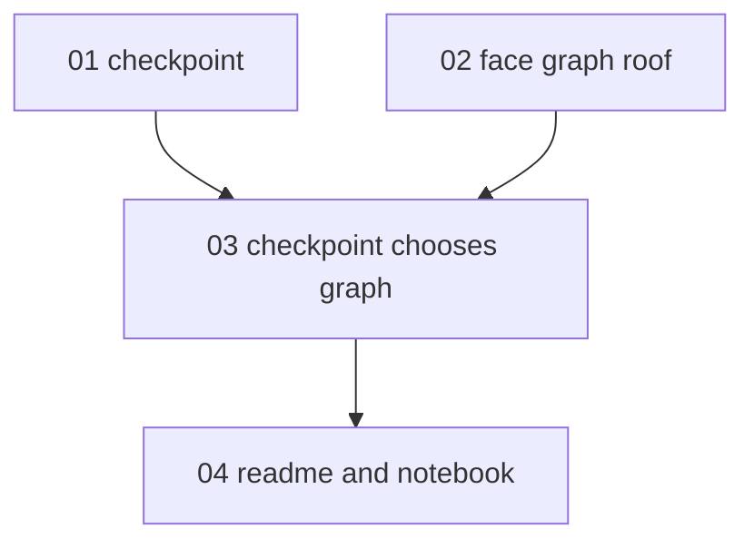

# Implementation report: experimental-gnn

- Feature: experimental-gnn
- PRD: [PRD.md](PRD.md)
- Started: 2026-09-23T16:11:00+0200
- Last updated: 2026-09-24T00:27:53+0200
- Parallelism cap: 1
- Integration branch: feat/ren-face-adjacency
- Harness: cursor
- Isolation: inplace
- Runner model: inherit
- Implementer model: grok (passed cursor-grok-4.6-xhigh)
- Firewall: degraded
- Preflight: primary checkout `/Users/mislavjordanic/Documents/projects/personal_projects/krovlab` on `feat/ren-face-adjacency`. Working tree clean except this report. `uv` 0.11.13. `/implement`, `/tdd`, and `/code-review` are present. Artifact paths in issues 02 and 04 are not gitignored. Nested wave-runner Task only allows `composer-2.5-fast`, so the orchestrator dispatches `issue-implementer` directly on `cursor-grok-4.6-xhigh`. No extra worktrees.

## Status

| ID | Title | Wave | Status | Agent ID | Worktree SHA | Integrated SHA | Started | Finished | Notes |
|---|---|---|---|---|---|---|---|---|---|
| 01-face-adjacency-checkpoint | Train and ship the face-adjacency checkpoint | 1 | committed | a35fe1b0-bd36-4a41-9900-857187baa737 | 8d578e4 | 8d578e4 | 2026-09-23T18:20:00+0200 | 2026-09-23T22:13:05+0200 | Issue file in done/. Held-out IoU 98.31%. |
| 02-roof-from-a-face-graph | Choose the method, and roof one footprint from a face graph | 2 | committed | d01e8714-9ddf-43f3-8bfc-534c0c5aa494 | f4effb6 | f4effb6 | 2026-09-23T22:25:38+0200 | 2026-09-23T23:13:10+0200 | Issue file in done/. In-place commit on feat/ren-face-adjacency. |
| 03-checkpoint-chooses-the-face-graph | Let the checkpoint choose the face graph | 3 | committed | b066860c-96fb-4db5-8381-35fb7f2e55be | fcc6711 | fcc6711 | 2026-09-23T23:13:10+0200 | 2026-09-24T00:13:52+0200 | Issue file in done/. In-place commit on feat/ren-face-adjacency. |
| 04-readme-and-notebook | README and notebook | 4 | committed | d8d8c2c4-8013-4092-8731-aeb641517888 | 63027a3 | 63027a3 | 2026-09-24T00:13:52+0200 | 2026-09-24T00:27:53+0200 | Issue file in done/. In-place commit on feat/ren-face-adjacency. |

## Dependency graph

## Wave plan

Cap 1 splits the ready set into one issue per wave. Implementer alias `grok` → `cursor-grok-4.6-xhigh`. Runner `inherit`.

1. Wave 1: `01-face-adjacency-checkpoint` — grok → cursor-grok-4.6-xhigh
2. Wave 2: `02-roof-from-a-face-graph` — grok → cursor-grok-4.6-xhigh
3. Wave 3: `03-checkpoint-chooses-the-face-graph` — grok → cursor-grok-4.6-xhigh
4. Wave 4: `04-readme-and-notebook` — grok → cursor-grok-4.6-xhigh

## Activity log

- 2026-09-23T16:11:00+0200 Spec committed as `4e79ac1`. Wave 1 `01-face-adjacency-checkpoint` marked in-progress, isolation inplace, before dispatch.
- 2026-09-23T16:12:00+0200 Wave 1 verified HEAD `feat/ren-face-adjacency` and a clean tree (report untracked). Persisted `in-progress` before dispatching `01-face-adjacency-checkpoint` in place.
- 2026-09-23T16:13:57+0200 Task rejected `model: cursor-grok-4.6-xhigh` (allowed slug: `composer-2.5-fast`). Did not substitute. `01-face-adjacency-checkpoint` blocked; no implementer spawned. Wave-runner agent `3f103315-96cd-404b-a4e2-d0f1d4637668`.
- 2026-09-23T16:15:00+0200 Firewall degraded. Orchestrator will dispatch `issue-implementer` for wave 1 on `cursor-grok-4.6-xhigh`, following `.agents/skills/implement/SKILL.md`. Row reset to in-progress.
- 2026-09-23T16:19:00+0200 Dispatched issue-implementer `23677cf0-0c1c-4ba6-b9d3-08370acab104` for `01-face-adjacency-checkpoint` on `cursor-grok-4.6-xhigh`. Prior launch was interrupted before any commit.
- 2026-09-23T16:25:00+0200 User stopped the implementer because permission prompts fired from this worktree. Agent interrupted. Issue returned to pending. No feature commit.
- 2026-09-23T18:20:00+0200 Moved to the primary checkout. Removed worktree `krovlab-ren-gnn`. Checked out `feat/ren-face-adjacency`. Redispatching `01-face-adjacency-checkpoint`.
- 2026-09-23T18:21:00+0200 Dispatched issue-implementer `a35fe1b0-bd36-4a41-9900-857187baa737` for `01-face-adjacency-checkpoint`.
- 2026-09-23T22:16:00+0200 Reconciled: `01-face-adjacency-checkpoint` is in `issues/done/` and commit `8d578e4` is on `feat/ren-face-adjacency`, whose merge-base with `develop` is `8d32e31`. No extra worktrees.
- 2026-09-23T22:23:16+0200 Resume preflight passed. `cursor-grok-4.6-xhigh` is allowed in this session. Firewall reset to intact for a wave-runner dispatch. Wave 2 `02-roof-from-a-face-graph` marked in-progress, isolation inplace, before dispatch.
- 2026-09-23T22:25:08+0200 Wave-runner `696ed218-607b-4b22-8a69-47d65096bebd` returned firewall degraded: nested Task rejected `cursor-grok-4.6-xhigh` (allowed: `composer-2.5-fast`). Did not substitute. No implementer spawned.
- 2026-09-23T22:25:38+0200 Firewall degraded. Orchestrator will dispatch `issue-implementer` for wave 2 on `cursor-grok-4.6-xhigh`, following `.agents/skills/implement/SKILL.md`. Row reset to in-progress.
- 2026-09-23T23:13:10+0200 `02-roof-from-a-face-graph` committed in place as `f4effb6` by issue-implementer `d01e8714-9ddf-43f3-8bfc-534c0c5aa494`. Issue file in done/. Wave 3 `03-checkpoint-chooses-the-face-graph` marked in-progress before dispatch.
- 2026-09-24T00:13:52+0200 `03-checkpoint-chooses-the-face-graph` committed in place as `fcc6711` by issue-implementer `b066860c-96fb-4db5-8381-35fb7f2e55be`. Issue file in done/. Wave 4 `04-readme-and-notebook` marked in-progress before dispatch.
- 2026-09-24T00:27:53+0200 `04-readme-and-notebook` committed in place as `63027a3` by issue-implementer `d8d8c2c4-8013-4092-8731-aeb641517888`. Issue file in done/. No `experimental-gnn/issue-*` branches or extra worktrees remain.

## Outstanding follow-ups

- `02-roof-from-a-face-graph`: the lift is a geometric shed or kernel fan, not the full Ren section 4 planarity optimiser.
- `03-checkpoint-chooses-the-face-graph`: a predicted dual still lifts with that ticket-02 fan/shed.

## Resume instructions

Re-run implement-issues with `.scratch/experimental-gnn`. Phase 2 reconciles from this report, git, and agent ids.
