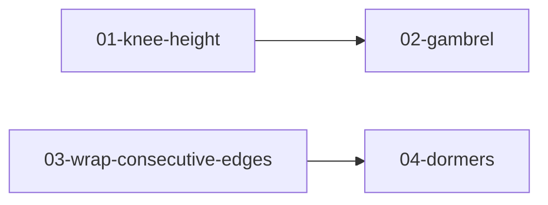

# Implementation report: roofs-beyond-skeleton

- **PRD:** [PRD.md](PRD.md)
- **Started:** 2026-09-09T14:33:00+02:00
- **Last updated:** 2026-09-09T16:50:00+02:00
- **Parallelism cap:** 1
- **Integration branch:** `develop`
- **Harness:** cursor
- **Isolation:** inplace
- **Runner-model:** inherit
- **Implementer-model:** grok (passed `cursor-grok-4.6-xhigh`)
- **Firewall:** intact
- **Preflight assumptions:** User chose cap 1 / inplace (option C). Integrate on `develop`. Treat issue Blocked-by titles `01 knee height` and `03 wrap consecutive edges` as ids `01-knee-height` and `03-wrap-consecutive-edges`. `Complexity: high` does not bump off grok. project-from-cells is already on the branch.

## Status table

| ID | Title | Wave | Status | Agent ID | Worktree SHA | Integrated SHA | Started | Finished | Notes |
|---|---|---|---|---|---|---|---|---|---|
| 01-knee-height | Knee height | 1 | committed | c771379b-1142-4b68-ac9e-c17d75562d0a | ae69564cf9525c508d86fd928ad44970015e693a | ae69564cf9525c508d86fd928ad44970015e693a | 2026-09-09T14:36:00+02:00 | 2026-09-09T15:08:01+02:00 | isolation=inplace; workspace=/Users/mislavjordanic/Documents/projects/personal_projects/krovlab; Knee height is metres of delay on roof() and Cell; gable plus knee is gable_versus_knee; click-to-set and POST knee-{i} match project(). Zero-knee roofs keep the original assembly path. |
| 03-wrap-consecutive-edges | Wrap consecutive edges | 2 | committed | c132f6a8-a397-4b91-890e-35e5baec38a2 | 4fb96734a295ca9587b5352315833087ad7467c3 | 4fb96734a295ca9587b5352315833087ad7467c3 | 2026-09-09T15:09:00+02:00 | 2026-09-09T15:46:00+02:00 | isolation=inplace; workspace=/Users/mislavjordanic/Documents/projects/personal_projects/krovlab; Wrap is a cell property on roof/project, wrap-0 on POST, and consecutive edge selection plus one plane in the editor; no public from-graph. Skeleton dual is topology only; wrap-corner vertices lift onto the wrap plane. Wrap ignores non-zero knee height. |
| 02-gambrel | Gambrel | 3 | committed | c56b7441-a311-4a16-81ce-f867656c5aaa | ed3ec5005d67e99a47f698e6ddd928961d5faab7 | ed3ec5005d67e99a47f698e6ddd928961d5faab7 | 2026-09-09T15:48:00+02:00 | 2026-09-09T16:24:41+02:00 | isolation=inplace; workspace=/Users/mislavjordanic/Documents/projects/personal_projects/krovlab; Gambrel is three numbers on an edge (steep, shallow, break metres above that cell's eave); the takeoff splits that wall into two faces. Wrap still embeds the steep pitch only, matching how it ignores knee. |
| 04-dormers | Dormers | 4 | committed | 98d22f26-ce2c-4bfa-b0a8-92609bcfe9a0 | 1391b79bb5ff48aa26b932f8937432396265c8e0 | 1391b79bb5ff48aa26b932f8937432396265c8e0 | 2026-09-09T16:26:48+02:00 | 2026-09-09T16:49:47+02:00 | isolation=inplace; workspace=/Users/mislavjordanic/Documents/projects/personal_projects/krovlab; Dormers are extra input to project (cell, plan ring, pitch list). Host sloped area loses the opening; named refusals are dormer_two_faces and dormer_outside. Form POST and plan-editor drawing write millimetre tables; 3D is the documented dormer exception. |

## Dependency graph

## Wave plan

1. Wave 1: `01-knee-height` — grok → `cursor-grok-4.6-xhigh`
2. Wave 2: `03-wrap-consecutive-edges` — grok → `cursor-grok-4.6-xhigh`
3. Wave 3: `02-gambrel` — grok → `cursor-grok-4.6-xhigh`
4. Wave 4: `04-dormers` — grok → `cursor-grok-4.6-xhigh`

Cap 1 split the two independent roots (01, 03) into consecutive single-issue waves (ID order), then the dependents (02 after 01, 04 after 03).

## Activity log

- 2026-09-09T14:33:00+02:00 Phase 0–1: preflight passed; user confirmed cap 1 / inplace / go.
- 2026-09-09T14:33:00+02:00 Phase 2: no prior report; no `done/` files; no `<id>:` commits; no owned worktrees.
- 2026-09-09T14:33:00+02:00 Wave 1: `01-knee-height` marked in-progress (inplace, repo root) before dispatch.
- 2026-09-09T14:36:00+02:00 Wave 1: re-persisted `01-knee-height` in-progress before issue-implementer dispatch.
- 2026-09-09T15:08:01+02:00 Wave 1: [Implement 01-knee-height](c771379b-1142-4b68-ac9e-c17d75562d0a) returned committed `ae69564cf9525c508d86fd928ad44970015e693a` on `develop` (`01-knee-height: add per-edge knee height as a delay`). Inplace: Worktree SHA == Integrated SHA; no cherry-pick.
- 2026-09-09T15:08:30+02:00 Orchestrator: merged wave 1 summary (1 committed). Totals: shipped 1, failed 0, blocked 0.
- 2026-09-09T15:08:30+02:00 Wave 2: `03-wrap-consecutive-edges` marked in-progress (inplace, repo root) before dispatch.
- 2026-09-09T15:09:00+02:00 Wave 2: re-persisted `03-wrap-consecutive-edges` in-progress before issue-implementer dispatch.
- 2026-09-09T15:46:00+02:00 Wave 2: [Implement wrap consecutive edges](c132f6a8-a397-4b91-890e-35e5baec38a2) returned committed `4fb96734a295ca9587b5352315833087ad7467c3` on `develop` (`03-wrap-consecutive-edges: embed consecutive edges as one plane`). Inplace: Worktree SHA == Integrated SHA; no cherry-pick.
- 2026-09-09T15:47:00+02:00 Orchestrator: merged wave 2 summary (1 committed). Totals: shipped 2, failed 0, blocked 0.
- 2026-09-09T15:47:00+02:00 Wave 3: `02-gambrel` marked in-progress (inplace, repo root) before dispatch.
- 2026-09-09T15:48:00+02:00 Wave 3: re-persisted `02-gambrel` in-progress before issue-implementer dispatch.
- 2026-09-09T15:48:30+02:00 Wave 3: dispatched [Implement 02-gambrel](c56b7441-a311-4a16-81ce-f867656c5aaa) (local, `cursor-grok-4.6-xhigh`).
- 2026-09-09T15:47:30+02:00 Wave 3: dispatched [wave-runner](4a9e3c79-8617-4d1a-9424-c42bf2741bfe) (local, inherit).
- 2026-09-09T15:51:00+02:00 Wave 3: [wave-runner](4a9e3c79-8617-4d1a-9424-c42bf2741bfe) returned early while [Implement 02-gambrel](c56b7441-a311-4a16-81ce-f867656c5aaa) was still running (no summary fence). No second implementer launched.
- 2026-09-09T15:52:00+02:00 Wave 3: resuming [wave-runner](4a9e3c79-8617-4d1a-9424-c42bf2741bfe) to wait on existing implementer and integrate.
- 2026-09-09T15:52:30+02:00 Wave 3: resuming [Implement 02-gambrel](c56b7441-a311-4a16-81ce-f867656c5aaa) (no interrupt; no second implementer).
- 2026-09-09T16:24:41+02:00 Wave 3: [Implement 02-gambrel](c56b7441-a311-4a16-81ce-f867656c5aaa) returned committed `ed3ec5005d67e99a47f698e6ddd928961d5faab7` on `develop` (`02-gambrel: add per-edge barn break as two stacked pitches`). Inplace: Worktree SHA == Integrated SHA; no cherry-pick.
- 2026-09-09T16:25:00+02:00 Orchestrator: merged wave 3 summary (1 committed). Totals: shipped 3, failed 0, blocked 0.
- 2026-09-09T16:25:00+02:00 Wave 4: `04-dormers` marked in-progress (inplace, repo root) before dispatch.
- 2026-09-09T16:25:30+02:00 Wave 4: dispatched [wave-runner](74edbeff-2f1e-4397-9d36-ae0bfbe4986d) (local, inherit).
- 2026-09-09T16:26:48+02:00 Wave 4: re-persisted `04-dormers` in-progress before issue-implementer dispatch. Cleared Agent ID `74edbeff-2f1e-4397-9d36-ae0bfbe4986d` (wave-runner, not implementer).
- 2026-09-09T16:26:48+02:00 Wave 4: dispatched [Implement 04-dormers](98d22f26-ce2c-4bfa-b0a8-92609bcfe9a0) (local, `cursor-grok-4.6-xhigh`).
- 2026-09-09T16:49:47+02:00 Wave 4: [Implement 04-dormers](98d22f26-ce2c-4bfa-b0a8-92609bcfe9a0) returned committed `1391b79bb5ff48aa26b932f8937432396265c8e0` on `develop` (`04-dormers: clip child roofs onto host faces after cells are roofed`). Inplace: Worktree SHA == Integrated SHA; no cherry-pick.
- 2026-09-09T16:50:00+02:00 Orchestrator: merged wave 4 summary (1 committed). Totals: shipped 4, failed 0, blocked 0.
- 2026-09-09T16:50:00+02:00 Phase 5: no owned `issue-*` worktrees or `roofs-beyond-skeleton/issue-*` branches. Run complete.

## Outstanding follow-ups

- Wrap was subsequently removed from the product. Findings and options:
  [`docs/future-work.md`](../../../docs/future-work.md) §6. Do not revive
  chord-plane embedding on the original outline.
- Wrap path (while it shipped) ignored non-zero `knee_height` rather than
  refusing the combination.

## Resume instructions

Re-run `/implement-issues .scratch/roofs-beyond-skeleton/` with cap 1 / inplace. Phase 2 reconciles from this file, `done/`, `<id>:` commits on `develop`, and Agent IDs.
